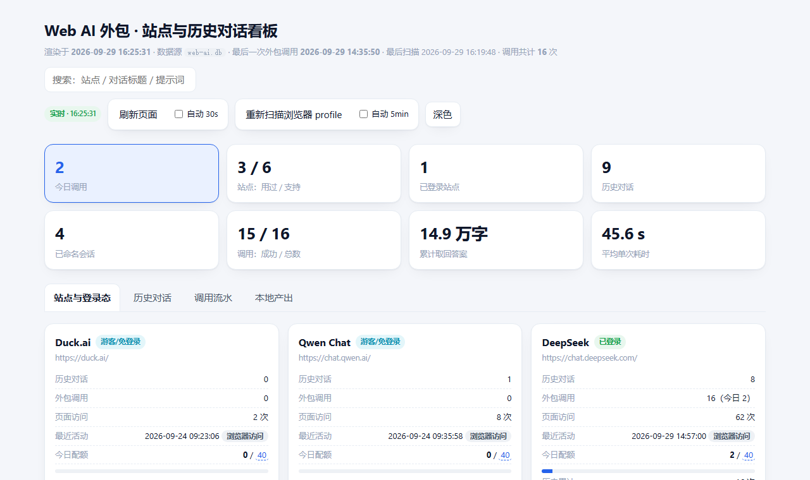

English | [简体中文](./README-zh.md)

# Outsourcing Skill · Supervisor Mode

> A skill that **outsources the heavy writing (HTML / code / text) to a web-based AI** while the agent acts as a **supervisor**: send a concise requirement, review the result, request concise fixes, and finally integrate and deliver.

```
User ──"outsource"──▶ Supervisor (Agent) ──concise req.──▶ Web AI (DeepSeek…)
                          ▲                                    │
                          │◀──────────── result ───────────────┘
                     review / rework
                          │
                    integrate ──▶ deliver
```

## What it solves

- Offloads the "typing / coding" compute to a **free web AI**; the main model only **distills requirements, reviews, and decides**, saving time and tokens.
- Prompts stay **deliberately short**: one line of requirement + one line of output spec. All the parsing/wiring is handled by local scripts.

## Core principles

1. **A supervisor makes decisions, not the deliverable**: distill requirement → dispatch → review → request rework → integrate & deliver.
2. **Keep prompts short** — long prompts are an anti-pattern.
3. **Prefer continuing the same conversation** (context helps); **when it gets contaminated, open a new one and attach the authoritative file** (web AIs have no cross-conversation memory — they only see the attachment).
4. **Small edits → "before/after" patches; large edits / additions / refactors / reskins → full file.** Web AIs cannot quote source verbatim, so "addition" patches always fail to anchor.
5. **Every full-file round must carry a "must-keep" checklist**, verified item by item.

> Full decision rules and pitfalls: [`SKILL.md`](./SKILL.md).

## Requirements

- **`ask-web-ai`**: a build of **free-web-ai-worker** that supports **`--session`** (named conversations). Referred to below as `$AWA`.
- **Node** (to run it) and **Python 3** (for `scripts/`).
- A **logged-in** web AI account (DeepSeek recommended: supports attachments and vision).

## Install

1. Put this directory into your skills folder, e.g. `~/.workbuddy/skills/外包skill/`.
2. Make sure `ask-web-ai` is available and note its directory (referred to as `$AWA`).
3. Log in to the target site once so the session is persisted under `~/.agent-web-ai/`.

## Repository layout

```
.
├── SKILL.md                 # Supervisor workflow + decision rules + pitfalls
├── README.md                # English (this file)
├── README-zh.md             # 简体中文说明
├── LICENSE                  # Apache-2.0
├── NOTICE
├── scripts/
│   ├── extract.py           # Extract a full file from the AI's reply
│   ├── apply_patch.py       # Apply "before/after" snippets as exact replacements
│   └── dashboard/
│       ├── collect.py       # Local read-only scan: sites / history / calls -> data.json
│       ├── render.py        # data.json -> offline single-file dashboard.html + checklist.md
│       └── make_demo.py     # Generates examples/dashboard-demo.html (fictional data)
├── docs/
│   └── dashboard-overview.png  # Dashboard screenshot
└── examples/
    └── dashboard-demo.html  # Sample dashboard — all data fictional, just open it
```

## Quick start

```bash
AWA=/path/to/free-web-ai-worker   # a build that supports --session

# 1) First outsourcing round: let the web AI produce a full file
#    (--session remembers this conversation for later rounds)
node "$AWA/bin/ask-web-ai.js" ask -p deepseek --session my-task \
  --file requirement.txt --timeout 180 --no-cache > result.json 2> result.err
python scripts/extract.py result.json target.html

# 2) Follow-up edit: resume the SAME conversation, change only one part (cheaper)
node "$AWA/bin/ask-web-ai.js" ask -p deepseek --session my-task \
  --file requirement.txt --timeout 180 --no-cache > reply.json 2> reply.err
python scripts/apply_patch.py reply.json target.html
```

Both scripts are pure standard-library Python — no dependencies.

## Sites & history dashboard

To answer "which AI sites am I signed in to, what did I discuss before, how many calls were made":

```bash
cd <your-output-dir>
python <skill>/scripts/dashboard/collect.py --tasks .   # local read-only scan -> data.json
python <skill>/scripts/dashboard/render.py              # -> dashboard.html + checklist.md
```

Dashboard preview (the "Sites & sign-in state" tab):



The dashboard is a single offline HTML file with four tabs: sites & sign-in state (with evidence and quota bars), past conversations (session names, call counts), call timeline (prompts, latency, status), and local artifacts.

Browser profile, tool directory and output directory are auto-detected; override with `--awa` / `--tool` / `--tasks` (or `AWA_HOME` / `AWA_TOOL` / `AWA_TASKS`).
Credentials are recorded as **length + fingerprint only, never in plaintext**; generated `data.json` / `dashboard.html` contain local paths and are excluded via `.gitignore`.

Want to see it before scanning your own machine? Just open **[`examples/dashboard-demo.html`](examples/dashboard-demo.html)** — a sample dashboard whose data is **entirely fictional** (marked "示例数据 · 全部虚构" at the top), safe to share. Regenerate it with `python scripts/dashboard/make_demo.py`.

## Security note

Outsourced content passes through a **third-party site** (DeepSeek, etc.). **Do not outsource confidential material.**

## Acknowledgements

The **idea** comes from the open-source project **[free-web-ai-worker](https://github.com/augustlies/free-web-ai-worker)** by [@augustlies](https://github.com/augustlies) (MIT) — it pioneered the pattern of "letting an agent outsource plain-text subtasks to a free web AI" and provides the CLI that drives the web AI.

This skill builds on it by packaging a **supervisor workflow**: concise requirement dispatch, review-and-rework loop, named-conversation resume (`--session`), "before/after" surgical replacement, and version management. Thanks to the original author for the exploration and for sharing it.

> This is an **independent project** and is not affiliated with the repository above. Please review each web AI site's terms of service before use.

## License

[Apache-2.0](./LICENSE)
